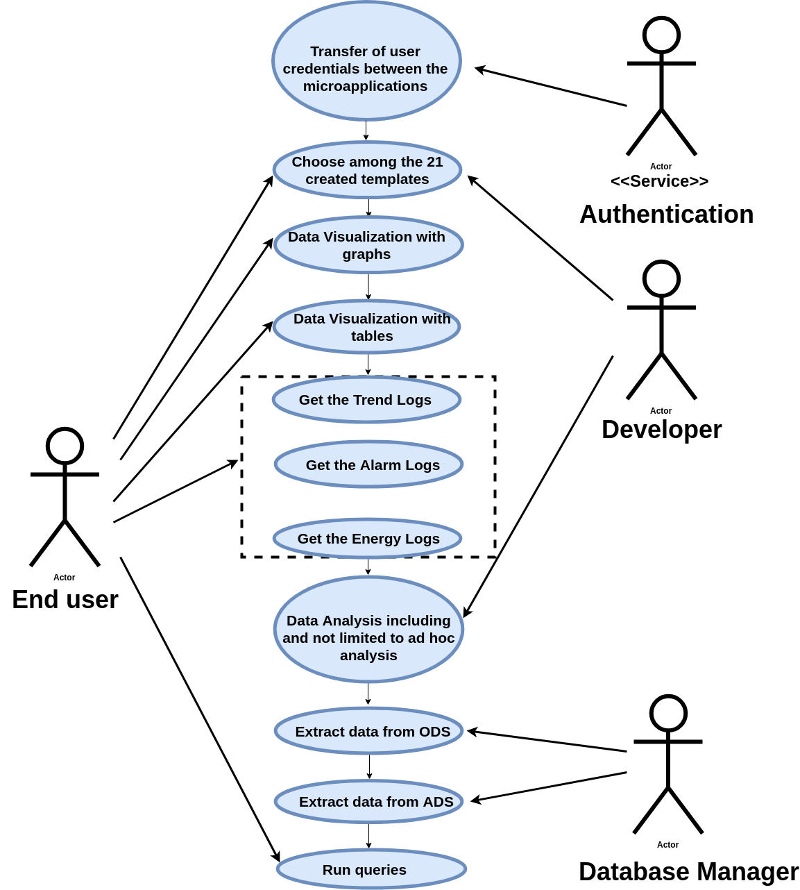

# SOFTWARE REQUIREMENT SPECIFICATION DOCUMENT

## METRICS MATTER

 BY :

    ● UJWAL NARAYAN N
    ● DEBOJIT DAS
    ● ARNAV KAPOOR
    ● CHINNI VENKATA CHARAN
    ● R.S SUBBULAKSHMI

## IOT Dashboard and Analytics using superset

### VERSION : 2.1

### INDEX

1. Introduction

    1. Need/Motivation
    2. Document Convention
    3. Intended Audience
    4. Project Scope
    5. References

2. Overall Description

    1. Product Features
    2. User Characteristics
    3. Operating Environment

3. Use cases

### INTRODUCTION

Superset is an open source platform; using D3 graphics and Python. The company is looking to use
Superset to configure, customize and build additional features required to create a comprehensive
analytics dashboard for IOT and building controls.
Current facilities have multiple supervisory systems which contain logs and data points and alarms. Our
platform is used to consolidate the data from these supervisory system and the project is to provide KPI's
for alarms, Trend Logs etc using dashboards.

#### 1.1 Need/Motivation

To push the analytics onto a web application so that the end users can easily use the software

#### 1.2 Document Convention

The document uses the following acronyms :\
&nbsp;● ODS : Operational Data Store\
&nbsp;● ADS : Application Data Store\
&nbsp;● SS : Super Set\
&nbsp;● DB : Database

#### 1.3 Intended Audience

The product is mainly targeted at businesses and performs analytics and data visualisation. It is
expected that people from both technical and a non-technical background are expected to
use this product

#### 1.4 Project Scope

The project is split into two major parts. Ad hoc analysis and the creation and customisation of
the 3 different templates in Superset. If any customizations are done which can be contributed and thus
improve the Superset application , the code will be given back to the open source community. Also of a
lower scope is the integration of Metrics matter with the existing application i,e Point Matter

#### 1.5. References

Superset : [Documentation](https://superset.incubator.apache.org/)

### OVERALL DESCRIPTION

#### 2.1 Product Features

    ● Extract data from ODS
    ● Extract data from ADS
    ● Integeration with the Point Matter Application
    ● Data Visualisation
    ● 3 Templates for the client to choose from
    ● Ad hoc analysis

#### 2.2 User Characteristics

    ● Databases uploaded by a user should be visible only to the user.
    ● Credentials to be passed between the micro-applications.

#### 2.3 Operating Environment

    1. Operating System : Linux , OSX , Windows
    2. Database system : MSSQL, sqlite3
    3. Platform : Flask with Angular and React

### USE CASES 

    ● Choose among the 3 created templates.
    ● Run SQL queries on your data and visualise the results.
    ● Data Visualization with graphs                
    ● Data Visualization with tables
    ● Get the Trend Logs
    ● Get the Alarm Logs
    ● Get the Energy Logs
    ● Data Analysis including and not limited to ad hoc analysis
    ● Extract data from ODS
    ● Extract data from ADS
    ● Transfer of credentials between the micro-applications
    ● Run queries
 

### USE CASE DIAGRAM
